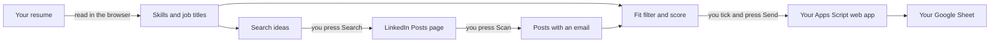

<p align="center"></p>

# Lead Catcher for LinkedIn

A Chrome extension for job seekers. You upload your resume, search LinkedIn posts, and press **Scan**. It reads the hiring posts on the page you have open, keeps the ones that match your resume and contain an email address, and saves the recruiter's **email, name, company, role, location and post link** to your own Google Sheet.

It only reads the page in front of you. It does not scroll for you, does not open pages by itself and does not call LinkedIn's API.

> **What this project does not do:** it does not send the first email. It fills a Google Sheet with contacts. You mail them yourself, or with a mail-merge script of your own. An optional script for one **follow-up** mail is included (see [Follow-up mail](#follow-up-mail-optional)).

---

## Contents

1. [What you get](#what-you-get)
2. [How it works](#how-it-works)
3. [What you need](#what-you-need)
4. [Setup, step by step](#setup-step-by-step)
5. [Daily use](#daily-use)
6. [How to get the best results](#how-to-get-the-best-results)
7. [How the decisions are made](#how-the-decisions-are-made)
8. [Follow-up mail (optional)](#follow-up-mail-optional)
9. [Updating](#updating)
10. [Troubleshooting](#troubleshooting)
11. [Privacy and permissions](#privacy-and-permissions)
12. [Limits and fair use](#limits-and-fair-use)
13. [Project files](#project-files)
14. [Third-party libraries](#third-party-libraries)

---

## What you get

| Feature | What it does |
|---|---|
| Resume reader | Reads a PDF, DOCX or TXT resume in your browser and picks out your job titles and skills |
| Search ideas | Builds LinkedIn search lines from your resume, with **Search** and **Copy** buttons |
| Page scan | Finds posts on the open LinkedIn page that contain an email address |
| Fit filter | Hides posts that ask for the wrong experience, the wrong place, contain words you want to skip, or come from a company you blocked |
| Fit score | Scores each contact out of 100 and puts the best matches on top |
| Tags | Shows "company email", "consultancy", "personal email", experience and place for each contact |
| Google Sheet | Sends the contacts you tick to your own sheet, one row each |
| Duplicate rules | The same post is never added twice. The same person is added again only for a new post, after a gap you choose |
| "Already in sheet" check | Tells you before you send which contacts are already in the sheet |
| CSV export | Works without any Google Sheet |
| Follow-up script | Optional. Sends one follow-up to people who did not reply |

---

## How it works



There are two parts:

- **The extension** runs in Chrome. It reads your resume, reads the LinkedIn page, filters and scores the contacts, and shows them in a side panel.
- **A small Google Apps Script** lives inside your own Google Sheet. The extension sends rows to it, and it writes them into the sheet. It is protected by a secret that you choose.

No server is involved. Your data goes from your browser to your own Google account and nowhere else.

---

## What you need

- Google Chrome, version 114 or newer (the side panel needs it)
- A Google account
- A LinkedIn account
- Your resume as PDF, DOCX or TXT (a scanned image PDF will not work, because it has no text)

Setup takes about 15 minutes, once.

---

## Setup, step by step

### Part 1: Download the extension

1. On the GitHub page of this repository, click the green **Code** button, then **Download ZIP**.
2. Unzip the file.
3. Move the unzipped folder to a place where it can stay, for example `Documents`. Chrome loads the extension from this folder every time, so do not delete or move it later.

If you use Git, you can clone the repository instead:

```bash
git clone <repository-url>
```

Check that the folder contains `manifest.json`. That is the folder you will pick in Part 5.

### Part 2: Create the Google Sheet

1. Open [sheets.new](https://sheets.new) in Chrome. A new, empty Google Sheet opens.
2. Click the title "Untitled spreadsheet" at the top left and give it a name, for example `Recruiter contacts`.
3. Leave the first tab empty. The script creates the header row for you on the first send:

| A | B | C | D | E | F | G | H |
|---|---|---|---|---|---|---|---|
| Email | Recruiter Name | Company | Status | Role | Location | Post Link | Added On |

Notes:

- It must be a **Google Sheet**. An Excel file on your computer will not work.
- If you already have a sheet with the columns **Email, Recruiter Name, Company, Status**, you can use it. The script finds the columns by their header text and adds Role, Location, Post Link and Added On to the right. Existing rows are not changed.
- The script always writes to the **first tab** of the spreadsheet.

### Part 3: Add the script to the sheet

1. In your Google Sheet, click **Extensions > Apps Script**. A new tab opens with the script editor.
2. You see a file named `Code.gs` with a few sample lines (`function myFunction() { }`).
   - **New project:** select everything in the editor and delete it.
   - **Project that already has your own code:** do not delete it. Click **+** next to **Files**, choose **Script**, and name the new file `LeadCatcher`.
3. Open `apps-script/LeadCatcher.gs` from the downloaded folder in any text editor (Notepad is fine). Select all, copy, and paste it into the Apps Script editor.
4. Find this line near the top:

   ```js
   const LC_SECRET = 'change-me-to-something-private';
   ```

5. Replace `change-me-to-something-private` with a password of your own. Keep the quotes. Example: `const LC_SECRET = 'blue-Tiger-4821';`
6. Press **Ctrl+S** (Cmd+S on a Mac) to save.
7. Optional: click "Untitled project" at the top and give the project a name.

Remember the secret. You will type the same value into the extension in Part 5.

### Part 4: Deploy the script as a web app

1. In the Apps Script editor, click the blue **Deploy** button at the top right, then **New deployment**.
2. Click the gear icon next to **Select type** and choose **Web app**.
3. Fill in the form:
   - **Description:** `Lead Catcher`
   - **Execute as:** `Me`
   - **Who has access:** `Anyone`
4. Click **Deploy**.
5. The first time, Google asks for permission:
   1. Click **Authorize access** and choose your Google account.
   2. If you see "Google hasn't verified this app", click **Advanced**, then **Go to (your project name) (unsafe)**. This warning appears for every script you write yourself.
   3. Click **Allow**.
6. Copy the **Web app URL**. It looks like this and ends in `/exec`:

   ```
   https://script.google.com/macros/s/AKfy...long-id.../exec
   ```

7. Click **Done**.

Why "Anyone": the extension has to reach the script without a Google login window. Every request without your secret is rejected.

### Part 5: Load the extension in Chrome and connect it

1. Open a new tab and go to `chrome://extensions`.
2. Turn on **Developer mode** (switch at the top right).
3. Click **Load unpacked**.
4. Pick the folder from Part 1, the one that contains `manifest.json`.
5. "Lead Catcher for LinkedIn" appears in the list. Click the puzzle icon in the Chrome toolbar and pin it, so the green envelope icon stays visible.
6. Click the Lead Catcher icon. The side panel opens on the right.
7. Click **Sheet setup** at the top of the panel.
8. Paste the **Web app URL** from Part 4.
9. Type the **Secret** from Part 3.
10. Click **Save**, then **Test connection**.

You should see: `Connected to "Recruiter contacts / Sheet1".` If you see an error, go to [Troubleshooting](#troubleshooting).

### Part 6: First-time settings in the panel

1. Under **1. Your resume**, click the upload box and choose your resume. Your job titles and skills appear as small chips.
2. Check the chips:
   - Click **×** on any chip that is not a real skill or title.
   - Type a missing skill or job title in the box and click **Add**.
   - The first chip that is a job title (for example `ai engineer`) is treated as your main title.
3. Open **Fit filter** and fill in what applies. Empty fields are ignored.

| Field | What to enter | Example |
|---|---|---|
| Your experience in years | Your total experience | `3` |
| Places you want | Cities, comma separated. Add `remote` if you accept it | `bangalore, hyderabad, remote` |
| Skip posts that contain these words | Words that rule a post out for you | `c2c, w2, us citizen, unpaid` |
| Companies never to contact | Your current employer, companies you already applied to | `acme, globex` |
| Mail the same person again after this many days | Gap before a person is added again for a new post. `0` means any new post | `3` |

Setup is finished.

---

## Daily use

1. **Open LinkedIn** in a tab and sign in. Click the Lead Catcher icon to open the panel.
2. **Pick a search.** Under **2. What to search on LinkedIn**:
   - Optional: type your city and choose the date range (default **Past 24 hours**).
   - Click **Run next search**, or **Search** on one line. LinkedIn opens the **Posts** results for that line, newest first.
   - Or click **Copy** and paste the line into LinkedIn's search bar yourself, then choose the **Posts** tab.
3. **Wait** until the posts have loaded.
4. **Scan.** Under **3. Read the LinkedIn page**, click **Scan this page**. The panel reports how many posts with an email it found.
5. **Collect more.** Tick **Keep scanning while I scroll** and scroll down the page at a normal pace. New posts are picked up as they load.
6. **Review the list** under **4. Contacts found**:
   - The number on the right of each contact is the fit score. Best matches are on top.
   - Read the tags: experience asked, place, company email or consultancy.
   - Fix the recruiter name or company name in the two boxes if the guess is wrong.
   - Click **Open post** when you want to read the original post.
   - Untick any contact you do not want.
   - Tick **Show N hidden by the fit filter** to see what was filtered out, with the reason.
7. **Send.** Click **Send N to Google Sheet**. The panel reports how many rows were added and how many were skipped, with the reason.
8. **Check the sheet.** New rows are at the bottom, with an empty **Status**.
9. **Repeat** with the next search line.

Other buttons:

- **Download CSV** saves the visible list as a file. Use it if you do not want a Google Sheet.
- **Clear** empties the list in the panel (click twice to confirm). Rows already in your sheet are not touched.

### What to do with the rows

The **Status** column is for you. Write "Sent" in it after you mail a contact, or let your own mail-merge script do that. Two things in this project read it:

- A person whose row still has an empty Status is not added a second time.
- The follow-up script only looks at rows whose Status contains the word "Sent".

---

## How to get the best results

**Resume and chips**

- Add your exact target job title as a chip if it is missing. It drives most of the search lines.
- Remove chips that are not skills. Wrong chips make unrelated posts look like matches.
- Add the short and long forms recruiters use, for example both `genai` and `generative ai`.

**Searching**

- Keep the date range on **Past 24 hours** and search once or twice a day. Fresh posts get fewer applicants.
- Work through all the search lines with **Run next search**. Different wording finds different posts.
- If a line returns very little, switch to **Past week**, or copy the line and remove the quoted part.
- The line with `"gmail.com"` finds recruiters who typed a personal address. The lines with `"send your resume"` and `"share your cv"` find the most common wording.

**Scanning**

- Scroll at a normal reading pace with **Keep scanning while I scroll** on.
- Emails written in comments are ignored on purpose. They are usually other job seekers.

**Reviewing**

- Always read the names before you send. Recruiter and company are best guesses.
- "company email" contacts are usually worth more than "consultancy" or "personal email" ones. These tags are hints, not facts.
- A contact tagged "check post" has an email but no clear hiring wording. Open the post first.
- Keep the block list up to date with your current employer.

**Mailing**

- Mention the role from the **Role** column in your subject line.
- Send a small number of mails per day and space them out.
- Follow up once after about five days, then stop.

---

## How the decisions are made

### Which posts become contacts

A post becomes a contact when its text contains an email address. Posts are shown only if they match at least one chip, unless you untick **Only matching my resume**.

### What the fit filter hides

| Rule | Hidden when |
|---|---|
| Skip words | The post contains one of your skip words |
| Job seeker | The post reads like someone asking for a job ("I am looking for a job", "open to work") |
| Blocked company | A blocked name appears in the company name, the email domain or the poster's headline |
| Experience | The post asks for a range you are outside. One year short still passes. "5+ years" has no upper limit |
| Place | The post names only places you did not list. "Remote" and "Pan India" pass. A post that names no place passes |

Hidden contacts are not deleted. A hidden contact is sent only if you tick it yourself.

### The fit score

| Part | Points |
|---|---|
| Skills from your resume found in the post | up to 50 |
| Your job title found in the post | 20 |
| Experience asked fits yours | 15 |
| Place fits | 10 |
| Clear hiring wording | 5 |
| You already sent someone at this company | minus 10 |

### When the same email is added again

An email that is already in the sheet gets a **new row** only when all of these are true:

- it comes from a different post than the one added last;
- at least the number of days you set have passed since it was last added (default 3);
- no earlier row for that email still has an empty Status.

The dates are remembered inside the Apps Script project (script properties), not in the sheet. Rows that were in the sheet before you installed the script count as added on the day of your first send.

---

## Follow-up mail (optional)

`apps-script/FollowUp.gs` sends one short follow-up to people you mailed who did not reply. It only works if you sent the first mail from the **same Gmail account** that owns the sheet, because it looks the mail up in Gmail's Sent folder.

### Install

1. In the Apps Script editor, click **+** next to **Files**, choose **Script**, and name it `FollowUp`.
2. Paste the whole content of `apps-script/FollowUp.gs` and save.
3. `LeadCatcher.gs` must be in the same project.

You do not need to deploy again. Follow-ups are run by hand from the editor, not through the web app.

### Use

1. Click the file `FollowUp.gs`.
2. In the function list next to **Run**, choose `previewFollowUps` and click **Run**. Approve the Gmail permission when asked. Nothing is sent and nothing is written. Read the list under **Execution log**.
3. When the list looks right, choose `sendFollowUps` and click **Run**.

### Rules

A row gets a follow-up when all of these are true:

- its **Status** contains "Sent";
- its **Follow-up** cell is empty;
- your last mail to that address is 5 to 30 days old;
- nobody replied in that conversation.

The mail is plain text, goes out as "Re: (your original subject)", and re-attaches the files from your original mail. The result is written in a **Follow-up** column that the script adds to the right: followed up, replied, bounced or too old. At most 20 are sent per run. The three numbers are at the top of the file.

---

## Updating

**The extension**

1. Download the new version and replace the files in the same folder.
2. Open `chrome://extensions` and click the reload icon on Lead Catcher.
3. Reload your LinkedIn tab once.

Your settings, resume chips and sheet connection are kept.

**The script**

1. Paste the new `LeadCatcher.gs` over the old one. Put your own `LC_SECRET` value back.
2. Save.
3. Click **Deploy > Manage deployments**, click the pencil icon, set **Version** to **New version**, and click **Deploy**.

If you skip step 3, the old code keeps running. The Web app URL stays the same.

---

## Troubleshooting

| Message or problem | What to do |
|---|---|
| `Add your web app URL under "Sheet setup" first (it ends in /exec).` | Paste the full Web app URL from Part 4. It must end in `/exec` |
| `Set LC_SECRET in the script first, then deploy a new version.` | You did not change the secret in the script. Change it, save, then publish a new version (see Updating) |
| `Wrong secret.` | The secret in the extension is not the same as `LC_SECRET` in the script. Check capital letters and spaces |
| `The sheet script did not return JSON. Re-deploy it with access set to "Anyone".` | The deployment is not set to **Anyone**, or the script has an error. Check **Deploy > Manage deployments** |
| `No "Email" column found in row 1 of the first tab.` | The first tab has a header row without an "Email" column. Add one, or use an empty tab |
| `No LinkedIn tab is open in this browser.` | Open linkedin.com in the same Chrome window |
| `The page did not answer. Reload the LinkedIn tab and try again.` | Reload the LinkedIn tab. This is normal right after installing or updating the extension |
| `No emails in the posts loaded on this page yet.` | Scroll to load more posts and scan again, or try another search line |
| Posts clearly show an email but the scan finds nothing | LinkedIn changes its page markup often. The selectors at the top of `content.js` are the place to look |
| `No text found. If the PDF is a scanned image, upload a DOCX or text version.` | Your PDF is an image. Export the resume again as a text PDF or DOCX |
| `Old .doc files are not supported.` | Save the resume as PDF or DOCX |
| "X contact(s) found, none match your resume keywords" | Untick **Only matching my resume**, or add more chips |
| All contacts are hidden | Tick **Show N hidden by the fit filter** and read the reasons. Loosen the field that hides too much |
| A change to the script has no effect | Publish a **New version** (see Updating) |
| The side panel does not open | Update Chrome to version 114 or newer |
| The sheet shows no new columns | They are added on the first real send, not on Test connection |

---

## Privacy and permissions

- Your resume is read inside your browser. Its text is never uploaded.
- Contacts go only to your own Google Sheet, through your own script.
- There is no analytics, no tracking and no outside server.
- The list in the panel is stored in Chrome's local extension storage on your computer. Contacts sent more than 45 days ago and unsent ones older than 30 days are removed from it automatically. Your sheet keeps every row.

| Permission | Why it is needed |
|---|---|
| `storage` | To remember your chips, settings and the contact list |
| `sidePanel` | To show the panel next to the page |
| `scripting` | To start the page reader in a LinkedIn tab that was already open |
| `linkedin.com` | To read the posts on the page you have open |
| `script.google.com`, `script.googleusercontent.com` | To send rows to your own script |

**Never commit your secret or your Web app URL to a public repository.** The file in this repository contains only the placeholder secret.

---

## Limits and fair use

- LinkedIn's terms of service do not allow automated collection of data. This tool reads only the page you have open and does nothing on its own, but you use it at your own risk. Use it at a normal human pace.
- Recruiter name, company, role, place and experience are guesses made from the post text with fixed patterns. They can be wrong. Check before you send mail.
- Emails inside images are not read.
- The place list knows the larger Indian cities and a few countries. Other places are read only from a "Location:" line.
- Only mail people about jobs they posted, and respect anyone who asks you to stop.

---

## Project files

```
lead-catcher/
├── manifest.json           Extension settings
├── background.js           Opens the side panel when you click the icon
├── content.js              Reads posts on the LinkedIn page
├── panel.html              Side panel layout
├── panel.css               Side panel styles
├── panel.js                Side panel logic: resume, search, scan, list, send
├── icons/                  Logo in four sizes, and the editable logo.svg
├── lib/
│   ├── extract.js          All text logic: emails, skills, fit, role, place
│   ├── pdf.min.mjs         PDF reader (pdf.js)
│   ├── pdf.worker.min.mjs  PDF reader worker (pdf.js)
│   └── fflate.js           Unzips DOCX files (fflate)
└── apps-script/
    ├── LeadCatcher.gs      Goes into your Google Sheet: writes the rows
    └── FollowUp.gs         Optional: follow-up mails
```

To use your own logo, replace the four PNG files in `icons/` with files of the same names and sizes, then reload the extension.

---

## Third-party libraries

- [pdf.js](https://github.com/mozilla/pdf.js) by Mozilla, Apache License 2.0
- [fflate](https://github.com/101arrowz/fflate) by 101arrowz, MIT License

This project is not affiliated with or endorsed by LinkedIn or Google.
